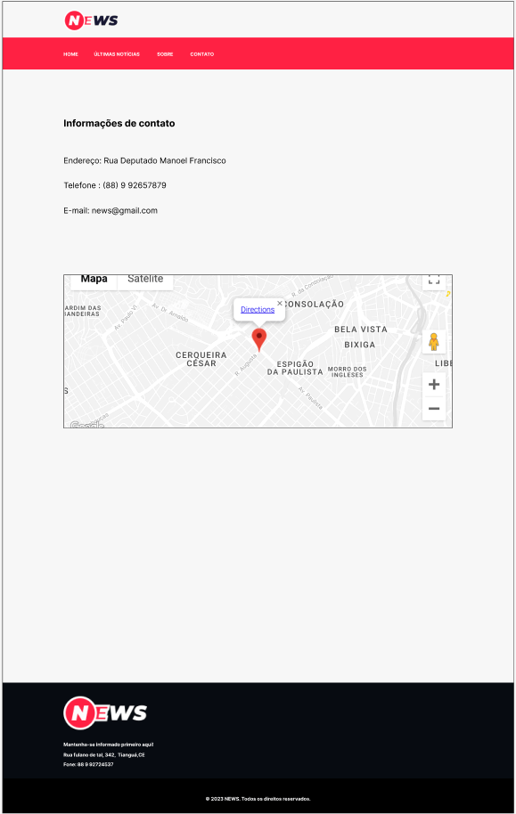

## Sistema de editoração de notícias

Esse sistema tem como objetivo principal cadastrar e aprovar notícias por meio de status de acesso, um status de acesso jornalista por exemplo tem apenas permissão para cadastrar as notícias e não pode aprovar o cadastro delas, isso é feito pelo editor, que aprós aprovar esse notícias ela então pode ser exibida no síte de notícias. O sistema além das validações de formulário tem outras validações de nível de acesso, por exemplo, no banck-end tem a validação de antes de salvar a notícia no banco de dados tem uma validação verificando se o status de acesso de quem está cadastrando a notícia é um jornalista, se for a notícia é cadastrada, se não for mostra uma mensagem de erro, a mesma validação é feita na operação de aprovar a notícia, além disso no front-end tem a mesma verificação de nível de acesso de bloqueia o botão deixando com o atributo 'disabled' impedindo de cadastrar ou aprovar uma notícias, outra validação é na exibição das telas de cadastro de notícia e aprovação que tem um if que bloqueia o acesso a tela que não pertence a esse perfil.

## Instalação

Para o correto funcionamento do sistema é necessário ter instalado o [postgres](https://www.postgresql.org/download/) no sistema operacional em que o projeto vai ser executado, esse [link](https://blog.cod3r.com.br/como-instalar-o-postgresql-no-windows/) tem um tutorial para instalação no windows, esse outro [link](https://medium.com/@thiagoreisdev/instalando-e-configurando-postgresql-no-ubuntu-86716cda5894) tem um tutorial de instalação no linux. Após instalado o postgres deve ser criado um banco de dados com nome 'news', e no arquivo .env do projeto deve ser informado a porta do servidor, o nome do banco de dados, o nome do usuário do banco de dados, a senha cadastrada no banco de dados durante a instalação do postgres e o host que será localhost se estiver rodando na suá máquina pessoal.

Para rodar o projeto deve ter instalado o Node JS e o NPM e rodar os comandos abaixo:

```bash
  npm install 
  npm run start
```

Após realizar as configurações acima e rodar os comando citados anteriormente na primeira execução do servidor é criado as tabelas de usuários e notícias automaticamente pelo sequelize, sendo possível então realizar todas as operações possíveis no sistema.

## Variáveis de Ambiente

Para rodar esse projeto, você vai precisar adicionar as seguintes variáveis de ambiente no seu .env

`PORT`

`BD`

`BD_USER`

`BD_PASSWORD`

`BD_HOST`

## Documentação da rotas

#### Renderiza página home do site de notícias

```
  GET /
```
*Sem parâmetros
##### Essa rota renderiza a página home do site de notícias onde listará todas as notícias cadastrada e aprovadas na dashboard.


#### Renderiza página de últimas notícias

```
  GET /lastedNews
```
*Sem parâmetros
##### Essa rota renderiza a página de últimas notícias cadastradas.


#### Renderiza página de detalhe da notícia

```
  GET /news/:id
```
*Parâmetro 'id' da notícia
##### Essa rota renderiza a página de últimas notícias cadastradas.


#### Renderiza página sobre

```
  GET /about
```
*Sem parâmetros
##### Essa rota renderiza a página sobre com os dados institucionais do site e seus integrantes


#### Renderiza página de contato

```
  GET /contact
```
*Sem parâmetros
##### Essa rota renderiza a página de contato com os dados de contato e endereço 



#### Renderiza página de login

```
  GET /signin
```
*Sem parâmetros
##### Essa rota renderiza a página de login onde o usuário cadastrado deverá fazer o o login para ter acesso a dashboard.


#### Renderiza página de registro de login

```
  GET /signup
```
*Sem parâmetros
##### Essa rota renderiza a página de registro de login onde um novo usuário deve realizar seu cadastro no sistema para poder realizar seu login posteriormente.


#### Renderiza página de cadastro de notícia

```
  GET /admin/create
```
*Sem parâmetros
##### Essa rota renderiza a página de cadastro de notícias onde o usuário com nível de acesso jornalista poderá cadastrar uma nova notícia.


#### Renderiza página de lista notícias para aprovação

```
  GET /admin/aprove
```
*Sem parâmetros
##### Essa rota renderiza a página de aprovar de notícias onde o usuário com nível de acesso editor irá visualizar a notícias a serem analisadas.


#### Renderiza página de aprovar de notícia

```
  GET /admin/aprove/:id
```
*Parâmetro 'id' da notícia
##### Essa rota renderiza a página de detalhe da notícia que será analisada para aprovação ou reprovação onde o usuário com nível de acesso editor irá realizar tal operação.


## Autores

- [@Diones Pereira Alves](https://github.com/Diones25)
- [@Danilo C de Sousa](https://github.com/danilocdesousa)
- [@Matheus Morais](https://github.com/Sr-Matheus)
- [@Whesley](https://github.com/Whesley362)

## Stack utilizada

**Back-end:** Node, Express, Multer, Express Flash, Express Session, PG, Sequelize, Bcryptjs, Dotenv, EJS, Moment JS, Chalk \
**Front-end:** EJS, Bootstrap, Core UI, SCSS, Shave JS
